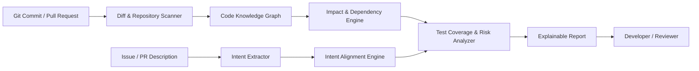

# TraceLens

### Explainable change-impact intelligence for safer software development

> **Logic League — Ideathon Submission**  
> **Theme:** Developer Tooling — Understanding Code Changes, Debugging, and Understanding Large Codebases

## Problem Statement

In real software projects, a small code change can have consequences far beyond the file being edited. A developer modifying an authentication helper, API response, database model, or shared utility may unknowingly affect downstream services, frontend screens, integrations, and tests.

Existing code-review workflows usually show a _diff_—what lines changed—but do not clearly explain **why the change matters, what may be affected, or what should be tested next**. This becomes especially difficult for student teams, new contributors, and developers working in unfamiliar or large codebases. The result is slower reviews, missed regressions, incomplete tests, and low confidence in changes.

**How might we help developers understand the real impact of a code change before it becomes a bug?**

## Existing Solutions

Current developer tools solve parts of the problem:

| Solution type         | What it does well                           | Gap TraceLens addresses                                              |
| --------------------- | ------------------------------------------- | -------------------------------------------------------------------- |
| GitHub/GitLab diffs   | Shows exactly which lines changed           | Does not explain downstream functional impact                        |
| Static-analysis tools | Finds syntax, type, and code-quality issues | Usually does not translate findings into a product-level explanation |
| AI code assistants    | Can summarize code and suggest edits        | May make unverified claims and often lacks codebase-wide evidence    |
| Test-coverage tools   | Reports what code was executed by tests     | Does not identify which _new risks_ a specific change introduces     |

TraceLens brings these signals together and makes its conclusions **verifiable**: each impact claim is linked to the relevant dependency, code location, or test evidence.

## Proposed Solution

TraceLens is an explainable developer tool that analyzes a pull request or Git commit and produces an evidence-grounded **change-impact report**.

It reads the code diff, maps relationships within the repository, identifies potentially affected components, compares the change against the issue or pull-request description, and recommends targeted tests. Rather than returning an opaque risk score, TraceLens shows the reasoning behind every insight.

For example, after a developer changes the format of an authentication token, TraceLens could report:

> **High-impact change:** The token parser is used by the login API, session middleware, and two frontend requests. Current tests cover valid logins, but no test verifies expired-token handling after the format change.

## Key Features

- **Plain-language change summary:** Explains what changed and the likely behavioural purpose.
- **Impact map:** Finds directly and indirectly dependent files, functions, APIs, and modules.
- **Evidence cards:** Links each warning or insight to the relevant changed line, dependency path, or test file.
- **Intent alignment:** Compares the issue/PR description with the actual change to surface possible scope drift.
- **Test navigator:** Identifies related existing tests and suggests high-value missing test cases.
- **Explainable risk assessment:** Assigns low, medium, or high risk with visible factors—not a black-box verdict.
- **Review-ready report:** Creates a concise pull-request summary that reviewers can inspect and verify.

## Technical Approach

1. **Ingest changes:** TraceLens receives a Git diff and optional issue or pull-request description.
2. **Build a code map:** Language parsers extract functions, imports, API calls, and test relationships. These are stored as a dependency graph.
3. **Trace impact:** Graph traversal finds modules and features that may be affected by changed symbols or interfaces.
4. **Analyze intent and risk:** An LLM summarizes the intended change and compares it with code evidence. Deterministic rules add signals such as changed public APIs, authentication code, database schemas, and missing related tests.
5. **Generate explainable output:** The tool produces a report where every conclusion includes links to the supporting code path and confidence level.

### Reliability by Design

Because AI can be incorrect, TraceLens does not present generated summaries as facts without support. It will:

- Separate confirmed code-graph facts from AI inferences.
- Attach evidence and confidence to every insight.
- Let users inspect the exact dependency path behind an impact warning.
- Fall back to static analysis when AI confidence is low.

## Technology Stack

| Layer         | Proposed technology                 | Purpose                                                |
| ------------- | ----------------------------------- | ------------------------------------------------------ |
| Interface     | React / Next.js                     | Pull-request dashboard and interactive impact map      |
| Backend       | Python FastAPI or Node.js           | Analysis API and report generation                     |
| Code analysis | Tree-sitter, AST parsers, Git       | Parse source code and diffs across languages           |
| Graph engine  | Neo4j or NetworkX                   | Store and traverse code dependencies                   |
| AI layer      | Small LLM / hosted LLM API with RAG | Explain changes and check intent against code evidence |
| Integrations  | GitHub REST/GraphQL API             | Access repositories, PR metadata, and test context     |
| Testing       | Pytest / Jest                       | Validate analyzer rules and report output              |

## Expected Impact

TraceLens can help developers make safer decisions before merging code.

- **Student teams:** Quickly understand each other’s contributions and learn how components connect.
- **New contributors:** Navigate unfamiliar open-source repositories with less onboarding time.
- **Reviewers:** Focus attention on high-risk areas instead of manually chasing every reference.
- **Development teams:** Catch missing tests and unintended impact earlier, reducing regressions and review cycles.

The intended outcome is not to replace developers or code reviewers. TraceLens gives them a transparent map of what to inspect, helping them review with better context and confidence.

## Future Scope

- GitHub App and IDE extensions for VS Code and JetBrains IDEs.
- Support for more languages and framework-specific dependency detection.
- Learning from accepted and rejected review comments to improve recommendations.
- Security-aware impact rules for authentication, permissions, and secret handling.
- Visual architecture maps that evolve automatically as a repository changes.
- Team-level dashboards for recurring hotspots, fragile modules, and test gaps.

## Feasibility and MVP

An initial working prototype can be built for JavaScript/TypeScript repositories. The MVP would accept a GitHub pull request, construct an import/function dependency graph, locate related tests, and generate an evidence-linked impact report for changed files. This narrower first version is achievable while leaving a clear path for more languages, integrations, and advanced AI capabilities.

---

**TraceLens — See beyond the diff. Understand the impact.**
Team Name - TraceLens
Team Memeber - Prachi Singh - Team Leader.
Sundaram Gupta.
Harsh Mishra.
